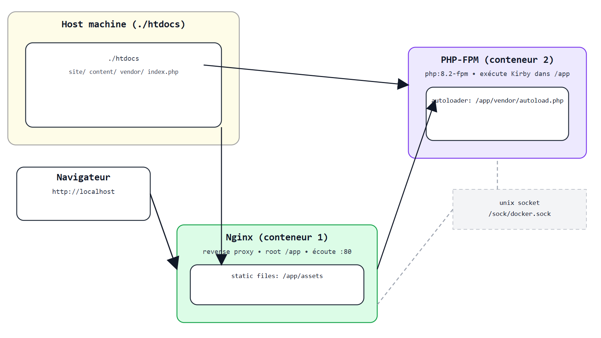

# 🛠 Gulp-Kirby Starter Kit — Documentation

## Introduction
Ce projet combine Kirby CMS avec une stack Docker (Nginx + PHP‑FPM). Il fournit un environnement reproductible pour le développement et l’onboarding rapide.

Le **Gulp-Kirby Starter Kit** est un boilerplate permettant de démarrer rapidement un projet **Kirby CMS (v3)** avec une chaîne de build front basée sur **Gulp v4**.

Il propose notamment :

- Compilation **Sass/CSS**
- Minification **HTML / CSS / JS**
- Optimisation des **images**
- Génération de **sprites SVG**
- Création de **favicons**
- **Font subsetting** (réduction du poids des polices)
- **Cache busting** via fingerprinting + intégration avec Kirby
- **Serveur de développement** intégré (PHP / proxy / BrowserSync)
- Structure **modulaire** via des tâches Gulp séparées
- **Configuration centralisée** dans `config.js`

## Stack & services

### Fichier
- **`docker-compose.yml`**

### Services
- **nginx (web)**
  - Image : `nginx:stable`
  - Écoute : `:80` (exposé sur l’hôte en `:80`)
  - Docroot : `/app`

- **php (php-fpm)**
  - Image : `php:8.2-fpm-alpine`
  - Communication avec Nginx via **socket Unix** (volume `sock`)
  - Extensions : `gd`, `imagick` (PECL), etc.

### Volumes partagés
- `sock` → `/sock` — socket Unix partagé Nginx ↔ PHP-FPM  
- `./htdocs` → `/app` — code, contenu, `vendor/`, `index.php`

### Notes
- **nginx** sert l’application depuis **`/app`** (mode “(1) : `index.php` dans `htdocs/`”).  
- **php** exécute **PHP-FPM 8.2** ; le même dossier hôte est monté dans **`/app`**.

### URL par défaut
- **http://localhost** (port `80`)  
  > Ajustable via `docker-compose.yml` (clé `ports`, ex. `"80:80"`).

## Prérequis d’installation (poste dev)

Docker Engine/Desktop 24+ avec Docker Compose v2.20+.

## Schéma de l’infra

## Références

- **Repo Starter :** [S1SYPHOS/Gulp-Kirby-Starter-Kit](https://github.com/S1SYPHOS/Gulp-Kirby-Starter-Kit)
- **Kirby CMS docs :** [getkirby.com/docs](https://getkirby.com/docs)

## 📈 Monitoring (Uptime Kuma)

**But :** surveiller que le site est up et recevoir une alerte en cas de panne.

### Emplacement & lancement

-   Fichier : `./monitoring/docker-compose.yml`
    
-   Démarrer :
    
    docker compose -f monitoring/docker-compose.yml up -d
    
-   Accès UI : **http://localhost:3001**
    
    > Au premier lancement, créez l’admin (Uptime Kuma vous le demande).
    

### Ajouter une sonde (monitor)

  **New Monitor** → Type **HTTP(s)**
    
  **Name** : `Kirby`
    
  **URL** :
    
    -   En local (Docker Desktop / WSL2) : `http://localhost`
        
    -   Si la sonde tourne dans un autre réseau Docker sous Linux, utilisez :
        
        -   `http://host.docker.internal` (si disponible)
            
        -   ou la **gateway Docker** (souvent `http://172.17.0.1`)
            
        -   ou un **nom de domaine/URL publique** si exposé
            
  **Heartbeat Interval** : 60s (par ex.)
    
  **Retries** : 3
    
  **Save**
    
> Astuce : si vos conteneurs (site et monitoring) partagent un réseau Docker commun, vous pouvez cibler `http://nginx:80` (nom du service) et éviter le passage par le host.

### Ajouter des alertes (Notifications)

  **Settings → Notifications → Add New Notification**
    
  Choisissez un canal et renseignez les champs :
    
    -   **Email (SMTP)** : serveur, port, TLS, user/pass, `From`, `To`
        
    -   **Telegram** : Bot Token + Chat ID
        
    -   **Discord / Slack** : Webhook URL
        
    -   **Webhook générique** : URL HTTP/POST (payload JSON au choix)
        
  **Save**, puis retournez sur la sonde → **Notifications** → associez le canal